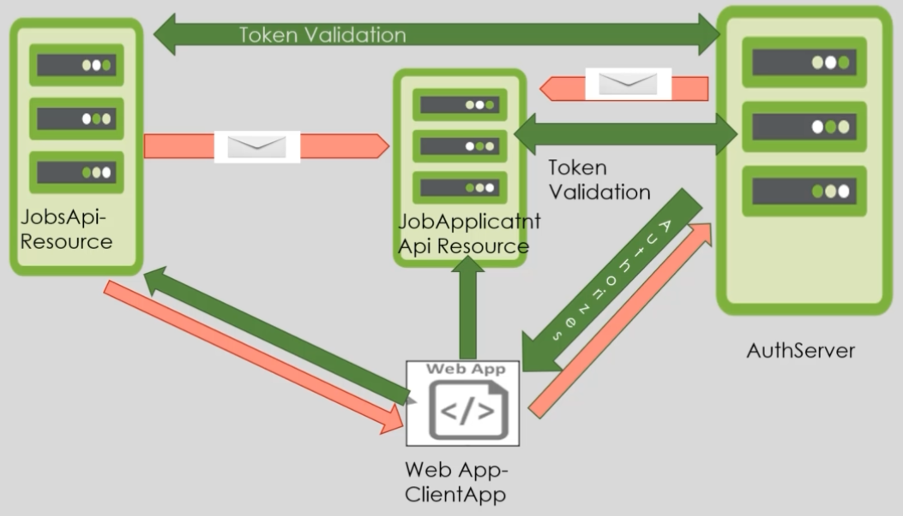

# Securing Microservices in Asp.Net Core World
An example application of securing microservices architecture for a fictional jobs system, using OAuth2 and OpenID protocols 🔐

# Architecture:

    

# Skills and Technical Competences 
* Developing simple microservices applications and secure them with specific protocols
* Learning the two important security protocols (OAuth2 and OpenId Connect) used nowadays in microservices architectures
* Protecting with the latest state-of the art security mechanism called PKCE to enhance the security of apps
* Secure microservices with a state of the art Centralized Authorization Server which implements the above two security protocols
* Make microservices communicate with each other either using direct call over the wire by  HttpClient
* Build User Management additions into the Authorization Server with role based authorization

# References
> The complete course can be found here [page](https://www.udemy.com/course/securing-microservices-in-aspnetcore-world-netcore5).